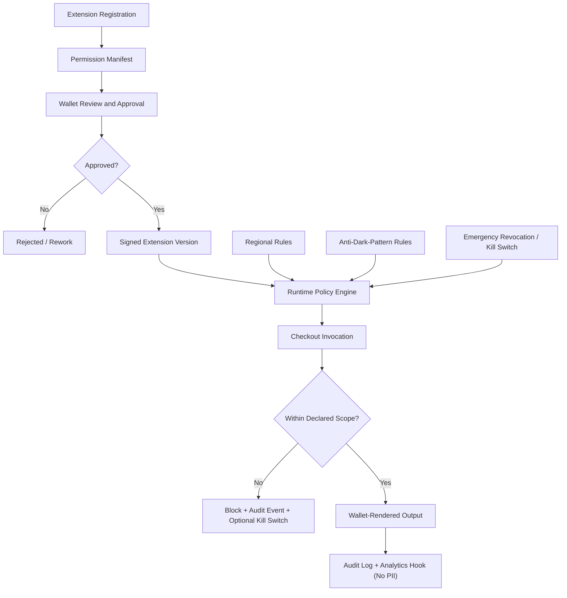

# WCE Permissions Diagram

```mermaid
flowchart TD
    A["Extension Registration"] --> B["Permission Manifest"]
    B --> C["Wallet Review and Approval"]
    C --> D{"Approved?"}
    D -- No --> E["Rejected / Rework"]
    D -- Yes --> F["Signed Extension Version"]
    F --> G["Runtime Policy Engine"]
    G --> H["Checkout Invocation"]
    H --> I{"Within Declared Scope?"}
    I -- No --> J["Block + Audit Event + Optional Kill Switch"]
    I -- Yes --> K["Wallet-Rendered Output"]
    K --> L["Audit Log + Analytics Hook (No PII)"]

    M["Regional Rules"] --> G
    N["Anti-Dark-Pattern Rules"] --> G
    O["Emergency Revocation / Kill Switch"] --> G
```
