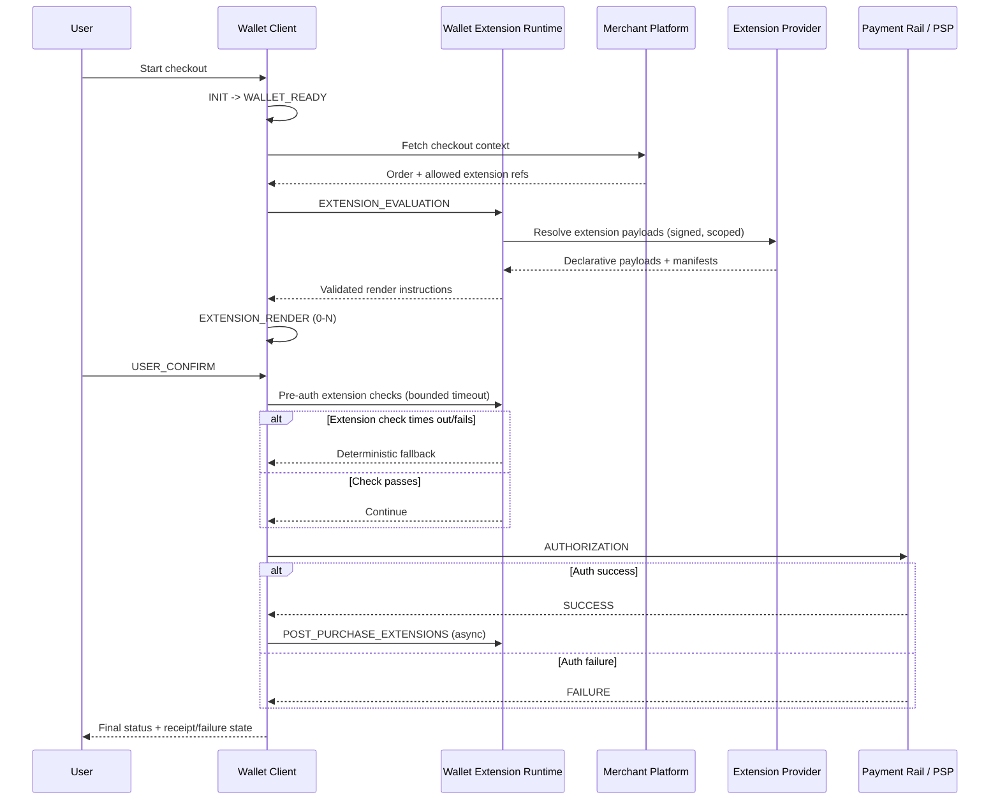

# WCE Checkout Sequence Diagram

```mermaid
sequenceDiagram
    participant U as User
    participant W as Wallet Client
    participant WE as Wallet Extension Runtime
    participant MP as Merchant Platform
    participant X as Extension Provider
    participant PSP as Payment Rail / PSP

    U->>W: Start checkout
    W->>W: INIT -> WALLET_READY
    W->>MP: Fetch checkout context
    MP-->>W: Order + allowed extension refs

    W->>WE: EXTENSION_EVALUATION
    WE->>X: Resolve extension payloads (signed, scoped)
    X-->>WE: Declarative payloads + manifests
    WE-->>W: Validated render instructions

    W->>W: EXTENSION_RENDER (0-N)
    U->>W: USER_CONFIRM

    W->>WE: Pre-auth extension checks (bounded timeout)
    alt Extension check times out/fails
        WE-->>W: Deterministic fallback
    else Check passes
        WE-->>W: Continue
    end

    W->>PSP: AUTHORIZATION
    alt Auth success
        PSP-->>W: SUCCESS
        W->>WE: POST_PURCHASE_EXTENSIONS (async)
    else Auth failure
        PSP-->>W: FAILURE
    end

    W-->>U: Final status + receipt/failure state
```
